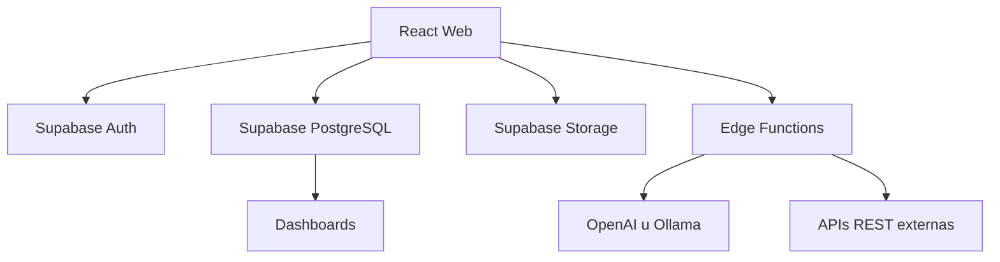

# Arquitectura inicial

```mermaid
flowchart TD
    A[React Web] --> B[Supabase Auth]
    A --> C[Supabase PostgreSQL]
    A --> D[Supabase Storage]
    A --> E[Edge Functions]
    E --> F[OpenAI u Ollama]
    E --> G[APIs REST externas]
    C --> H[Dashboards]
```
